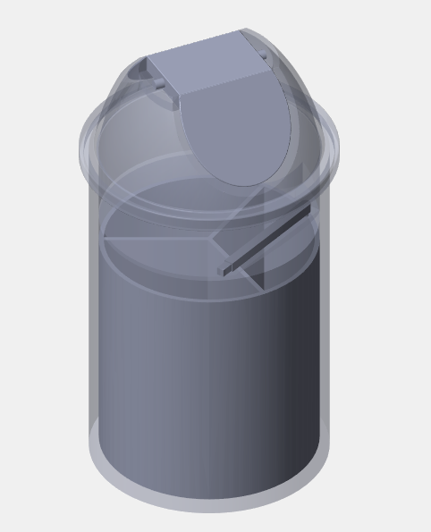

# Self-Sorting Garbage Bin for an Office Environment

This repository contains MATLAB and Simulink files for the project "Self-Sorting Garbage Bin for Office Environments." The project aims to design and implement an intelligent garbage bin that automatically sorts office waste into paper, polythene, and hard plastic categories. The system uses advanced sensors and automation to improve recycling efficiency and promote sustainable waste management practices in office settings.

## Contents:
<ul>
  <li>MATLAB code for sensor integration and waste identification</li>
  <li>Simulink models for system control and automation</li>
  <li>Documentation and design specifications</li>
</ul>

## Contributors

