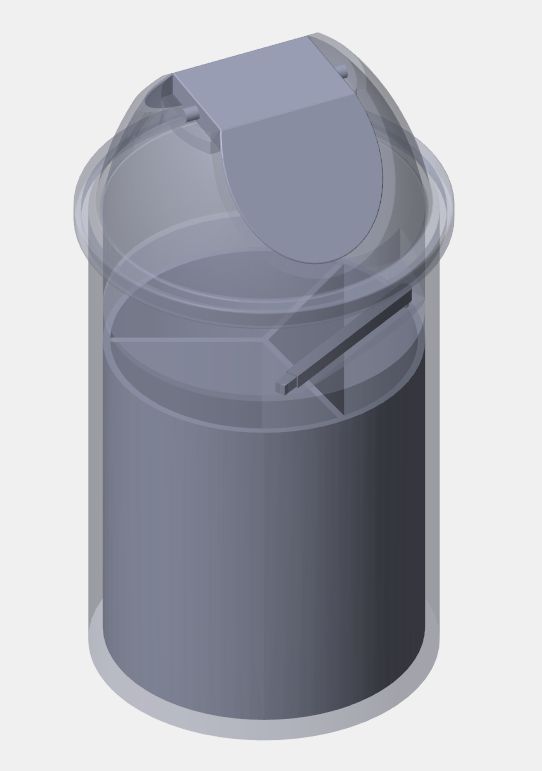
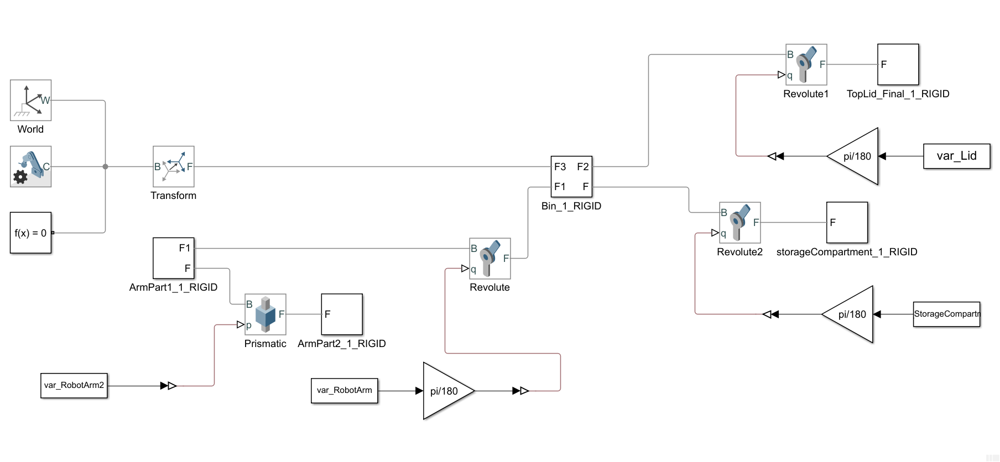

# Self-sorting Garbage Bin for an Office Environment

A Technological-Sustainable Approach to Office Waste Reduction

## Contributors

## Table of Contents
1. [Introduction](#introduction)
2. [Project Overview](#project-overview)
3. [System Components](#system-components)
4. [Design and Implementation](#design-and-implementation)
   - [SolidWorks Design](#solidworks-design)
   - [MATLAB Simulink](#matlab-simulink)
   - [MATLAB Code](#matlab-code)
5. [Usage](#usage)
6. [Contributors](#contributors)
7. [License](#license)

## Introduction
In today’s environmentally conscious world, efficient waste management solutions are critical. This project focuses on designing and implementing an innovative self-sorting garbage bin tailored for office environments. The bin autonomously categorizes and facilitates the disposal of diverse waste materials, fostering recycling practices and minimizing contamination.

## Project Overview
The self-sorting garbage bin system excels in sorting paper, polythene, and hard plastic, boasting a compact design for space efficiency and exceptional durability for long-lasting performance. This project streamlines waste disposal and raises awareness, encouraging responsible waste practices among office personnel.

## System Components
- **Sensors**: To identify different waste types.
- **Microcontrollers**: To control the sorting mechanism.
- **Actuators**: To direct waste to the appropriate bins.
- **Software**: Developed using MATLAB Simulink and SolidWorks.

## Design and Implementation
### SolidWorks Design
The parts of the dustbin were designed using SolidWorks. The design includes:
- **Main Bin Structure**: The primary framework of the self-sorting bin.
- **Sorting Mechanism**: Components responsible for waste segregation.

  

<em>Main Bin Structure designed in SolidWorks</em>

### MATLAB Simulink
Simulink models were used to simulate the behavior of the self-sorting bin. These models include:
- **Sensor Data Processing**: Interprets data from sensors to identify waste types.
- **Control Logic**: Manages the sorting mechanism based on sensor input.

*Simulink model of the self-sorting bin*

### MATLAB Code
MATLAB scripts were developed to process sensor data and control the sorting mechanism. These scripts include:
- **Data Acquisition**: Collects data from sensors.
- **Sorting Algorithm**: Determines the appropriate bin for each waste type.

## Tools Used

This project utilized various software tools for design, simulation, and documentation:

| Tool       | Description                                             |
|------------|---------------------------------------------------------|
|  | MATLAB: Used for data analysis and algorithm development. |
|  | Simulink: Employed for modeling and simulating dynamic systems. |
|  | SolidWorks: Used for 3D modeling and mechanical design. |
|  | LaTeX (Overleaf): Utilized for preparing high-quality documents and reports. |

  
## Usage
To use the self-sorting garbage bin system:
1. **Design Setup**: Review the SolidWorks files and set up the bin structure.
2. **Simulation**: Use the Simulink models to simulate the system's behavior.
3. **Implementation**: Deploy the MATLAB scripts to control the sorting mechanism in a real-world setup.

## Contributors
- **Prabath P T** - [prabathpt.21@uom.lk](mailto:prabathpt.21@uom.lk)
- **Prabhashana M R M** - [prabhashanamrm.21@uom.lk](mailto:prabhashanamrm.21@uom.lk)
- **Prabhashwara H M R** - [prabhashwarahmr.21@uom.lk](mailto:prabhashwarahmr.21@uom.lk)
---

We hope this project contributes to a more sustainable and eco-friendly office environment. For more information, refer to the research paper included in this repository.
